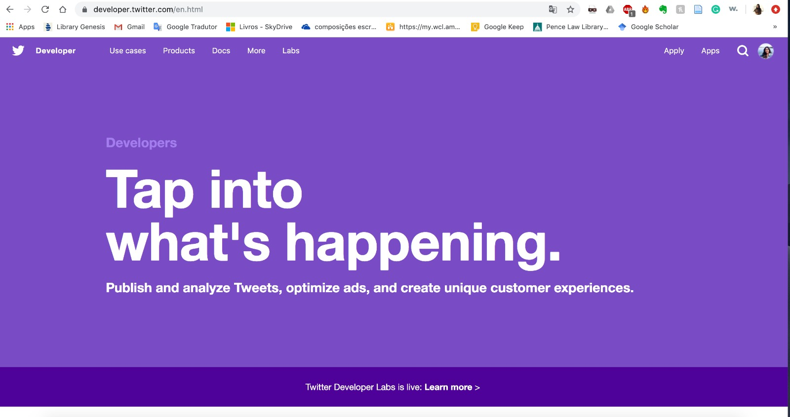
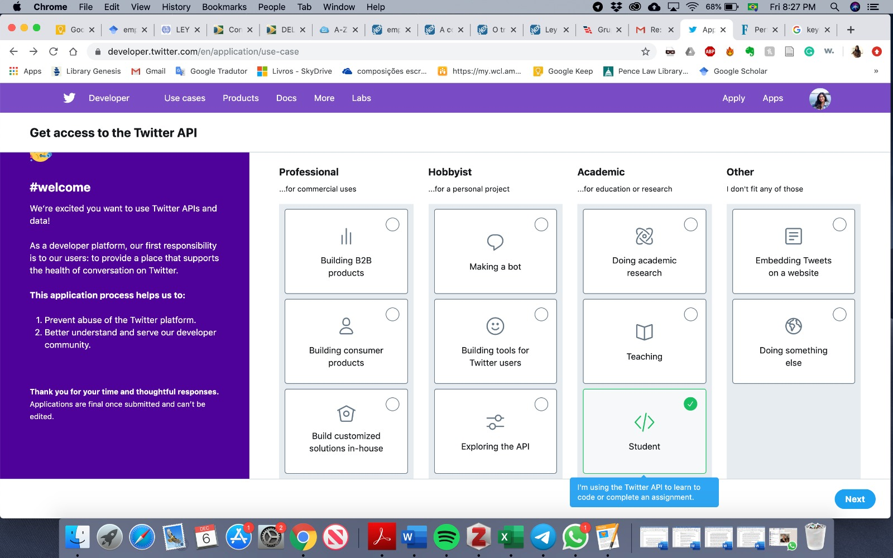
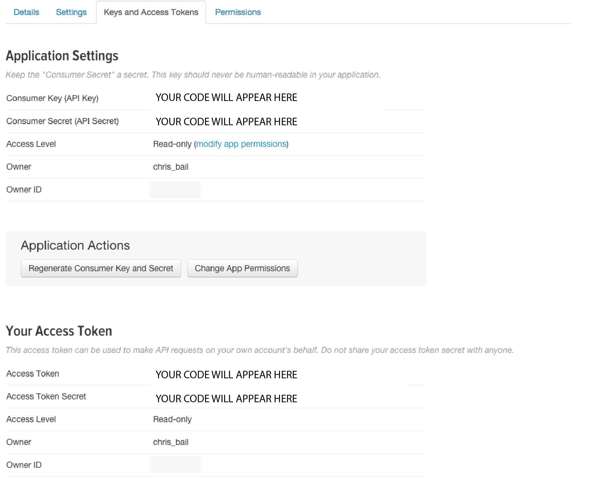

Introducción
===========

Este tutorial está diseñado para que puedas tener acceso al API de Twitter. Recomiendo seguir el tutorial lo antes posible para que la aprobación esté lista para el primer día del curso. Este tutorial está adaptado de uno similar creado por mi colega y amigo, [Tiago Ventura](https://tiagoventura.rbind.io/)

Twitter API
===========

El API de Twitter es, sin duda alguna, uno de los APIs más utilizados por investigadores. Lo primero que debemos hacer es registrarnos a [Twitter](https://twitter.com/home). Es decir, necesitan tener una cuenta de Twitter, común y corriente (y voy a asumir que la mayoría ya la tiene). Una vez que accedes a tu cuenta de Twitter, debes ir a la página de [desarrolladores (developer website)](https://developer.twitter.com/) y crear una cuenta especial. En esta página, debes darle click en la esquina superior derecha donde dice *dashboard app*. 

Dale click de nuevo para aplicar. Selecciona la opción de estudiante, como se muestra a continuación:

Ahora Twitter va a solicitar una serie de datos personales como tu número de teléfono, to dirección, y por qué quieres una cuenta de desarrollador (*developer account*). Se honestx. Lo que estamos haciendo está permitido en las reglas de Twitter. Escribe que estás tomando un curso en ciencas de datos y que vas a usar Twitter para fines educacionales. Cada vez que Twitter te pida que hagas referencia a una página web, copia la dirección de la página de GitHub del curso (https://github.com/svallejovera/sergio_arboleda_analisis_de_redes). 

Aquí existe una posible dificultad. Twitter solo acepta aplicaciones en inglés (maldito colonialismo). Sin embargo, no debe preocuparte de escribir nada muy elaborado. Se objectivx y no dude en usar el traductor de Google si necesitas ayuda. 

Una vez que termines de llenar el formulario, envíalo para que vaya a revisión. Tu solicitud puede ser aceptada de immediato o Twitter puede que te solicite más información (una vez más, se honestx, responder objectivamente, etc.). Mi sugerencia es que inicies este proceso lo antes posible. Nunca sabes cuánto tiempo puede tomar. 

Una vez que tu cuenta de desarrollador esté aprovada, puede ingresar de nuevo y darle click al botón de "Create a new app" que aparece en la esquina superior derecha de tu pantalla. Nuestro objetivo no es crear una aplicación, sino obtener las credenciales necesarias para comenzar a utilizar el API de Twitter en R. Si todo ha salido bien, deberás ver la siguiente imagen:

Estas son tus credenciales. No las comparatas con nadie. En el curso aprenderemos como utilizar estas credenciales y bajarnos borbotones de tweets. Una vez que estés más familiarizado con la plataforma y quieras desarrollar una proyecto de investigación más amplio, sugiero que apliques para una cuenta académica utilizando el API_V2. Las instrucciones para aplicar a este espacio las puedes encontrar [aquí](https://github.com/twitterdev/getting-started-with-the-twitter-api-v2-for-academic-research). 
  
                